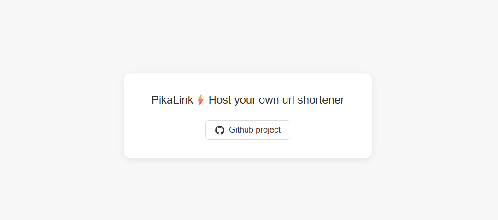
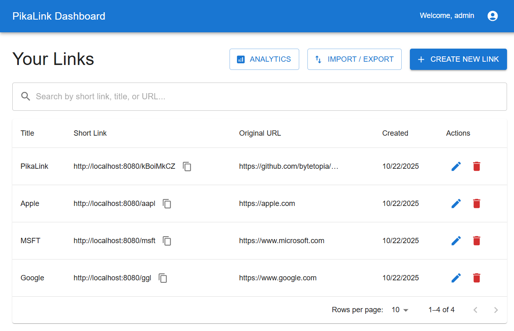
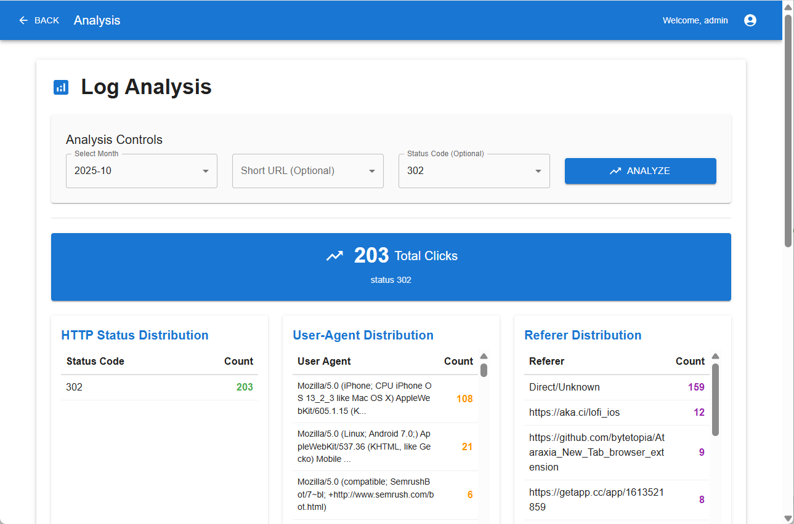
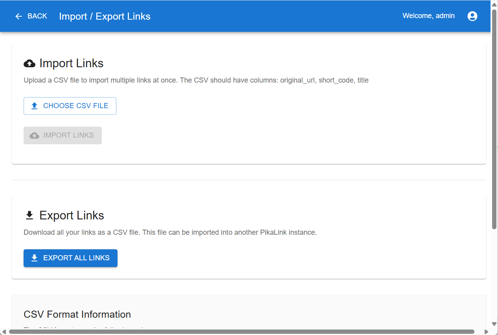

# PikaLink ⚡️ - Lightweight URL Shortener

A full-stack URL shortener application built with Go backend and React frontend.

> [!NOTE]
> This project is actively iterating. Current release is ready for use with basic functionalities, but the API / DB schema might have siginificant change in the near future. It's not recommended to use it in production business yet.


## 📚 Features

- Lightweight app
   - Built with Go for great performance and easy deployment
   - SQLite database

- Admin interface with Material-UI
   - Create, update, delete, search links
   - Link access logs and analysis, including referer, UA and IP analysis
   - Batch import / export links

## 💻 Screenshots

<table>
<tr>
<td>
   
   <p>Home page </p>
</td>
<td>
   
   <p>URL list page </p>
</td>
</tr>
<tr>
<td>
   
   <p>Access log analysis</p>
</td>
<td>
   
   <p>Batch import / export</p>
</td>
</tr>
</table>


## 🤖 Selfhost 

We provide prebuilt docker image, available at [bytetopia/pikalink](https://hub.docker.com/r/bytetopia/pikalink)

### Environment Variables

PikaLink supports the following environment variables for configuration:

| Variable | Required | Default | Description |
|----------|----------|---------|-------------|
| `DATA_PATH` | No | `.` (current directory) | Path where SQLite databases and log files are stored |
| `GEO_IP_DB_PATH` | No | None | Path to directory containing GeoLite2 MMDB files for IP geolocation analysis |
| `CORS_ORIGINS` | No | `http://localhost:3000` | Comma-separated list of allowed CORS origins |

#### GeoLite2 Database Setup (Optional)

For IP geolocation analysis in access logs, you'll need to download GeoLite2 databases:

1. Sign up for a free MaxMind GeoLite2 account at [https://www.maxmind.com/en/geolite2/signup](https://www.maxmind.com/en/geolite2/signup)
2. Download `GeoLite2-City.mmdb` and `GeoLite2-ASN.mmdb` files
3. Place them in a directory and set `GEO_IP_DB_PATH` to that directory path
4. Without these files, the app will work but won't provide geographic analysis of visitors

### Docker Deployment

```bash
# Using Docker Hub
docker run -d \
  --name pikalink \
  -p 8080:8080 \
  -v pikalink_data:/app/data \
  -e DATA_PATH=/app/data \
  --restart unless-stopped \
  bytetopia/pikalink:latest
```

**With GeoLite2 databases:**
```bash
# Create directories for data and geolite databases
mkdir -p ./pikalink_data ./geolite2_data

# Download your GeoLite2 databases to ./geolite2_data/

# Run with geolocation support
docker run -d \
  --name pikalink \
  -p 8080:8080 \
  -v ./pikalink_data:/app/data \
  -v ./geolite2_data:/app/geolite \
  -e DATA_PATH=/app/data \
  -e GEO_IP_DB_PATH=/app/geolite \
  --restart unless-stopped \
  bytetopia/pikalink:latest
```

You can also use docker-compose for quick deployment. Update the volume path in [docker-compose.yml](./docker-compose.yml) to match your host system:

```bash
# Edit docker-compose.yml to set your host path, then:
docker-compose up -d
```

> Visit `https://your.own.url/admin` for the admin portal.
>
> Default credential: user `admin`, pwd `admin123`.
> Please change the password after you login.


## 🔧 Build

### Quick Build (Automated)

Use the provided build scripts for easy production builds:

**Windows (PowerShell):**
```powershell
.\build.ps1
```

**Linux/macOS (Bash):**
```bash
chmod +x build.sh
./build.sh
```

This will create a `dist` directory with all production files ready for deployment.

```
dist/
├── pikalink          # or pikalink.exe on Windows
├── frontend/          # Built React app
│   ├── index.html
│   ├── static/
│   └── ...
└── pikalink.db       # SQLite database (created on first run)
```

Copy the `dist` directory to your server and run the executable, application will start on port 8080 by default.

**Running with custom configuration:**
```bash
# Set environment variables before running
export DATA_PATH=/path/to/your/data
export GEO_IP_DB_PATH=/path/to/geolite2/databases
export CORS_ORIGINS="https://yourdomain.com,https://anotherdomain.com"

# Run the application
./pikalink
```

### Development Setup

#### Backend Setup

1. Navigate to the backend directory:
   ```powershell
   cd backend
   ```

2. Install dependencies:
   ```powershell
   go mod tidy
   ```

3. Run the server:
   ```powershell
   go run main.go
   ```

The backend will start on `http://localhost:8080`

#### Frontend Setup

1. Navigate to the frontend directory:
   ```powershell
   cd frontend
   ```

2. Install dependencies:
   ```powershell
   npm install
   ```

3. Start the development server:
   ```powershell
   npm start
   ```

The frontend development server will start on `http://localhost:3000/admin/`


## License

This project is licensed under the MIT License.